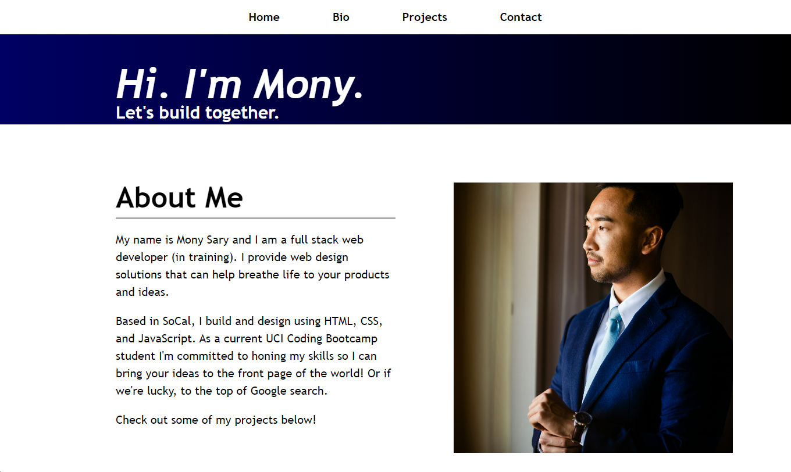

# Developer Portfolio

## Description

This is my first developer portfolio website. This portfolio website highlights a little bit about me and showcases some of the projects I've worked on so far.

## Installation

Load the webpage using any browser by using the following link: https://monysary.github.io/Developer-Portfolio/

## Usage

My portfolio website features a navigation bar that takes you to different areas of the webpage based on the link you click. All clickable items on the webpage also features an animation that shows the user is hovering over an clickable item. This webpage is also modified to fit various device screen sizes and layouts including computers, tablets, and phones.

The About Me section covers a brief summary of my current status and skill set as a growing web developer. It also has a picture of me on my wedding day :smile:.

The My Projects section showcases all of the projects of worked on and deployed so far as of writing this README.

The Contact Me section will contain my phone number and email for best ways to contact me.

## Credits

N/A

## License

N/A